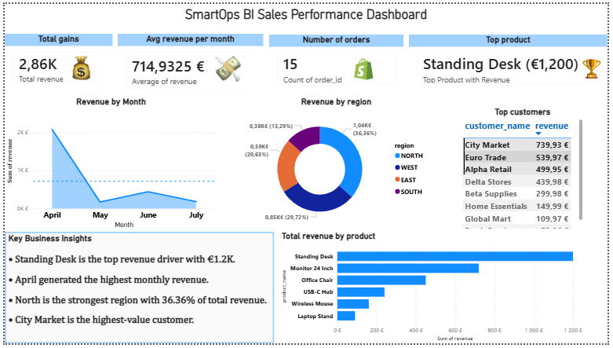

# SmartOps BI – Automated Sales Reporting Dashboard

SmartOps BI is an end-to-end Business Intelligence portfolio project that simulates a sales reporting workflow.

The project uses **Python**, **Pandas**, **PostgreSQL**, **SQL views**, **CSV exports**, and **Power BI** to transform raw sales data into clean KPI reports, dashboard visuals, and automated business insights.

The goal of this project is to demonstrate a practical BI workflow similar to what companies use for sales performance monitoring, KPI tracking, and reporting automation.

---

## Dashboard Preview



---

## Project Result

The project reduces manual reporting effort by replacing repeated manual SQL exports with a repeatable reporting workflow.

**Key result:**

> Reduced KPI export workflow from 5 manual SQL commands to 1 automated reporting workflow, including Power BI-ready CSV exports and an automated business insight summary.

---

## Tech Stack

| Area | Tools |
|---|---|
| Data generation and cleaning | Python, Pandas |
| Database | PostgreSQL, Docker |
| Querying and KPI logic | SQL, SQL Views |
| Reporting automation | Bash, Python |
| Dashboarding | Power BI |
| Documentation | Markdown, GitHub |

---

## Business Questions

The dashboard answers the following sales performance questions:

- How much total revenue was generated?
- How does revenue develop over time?
- Which products generate the most revenue?
- Which customers contribute the most revenue?
- Which regions perform best?
- How can KPI reporting be made repeatable and easier to refresh?

---

## Key Features

- Raw sales data generation with Python
- Data cleaning and preparation with Pandas
- PostgreSQL database running in Docker
- SQL schema for customers, orders, order items, and products
- SQL KPI views for reporting
- Automated export of KPI views into Power BI-ready CSV files
- Power BI dashboard with revenue, product, customer, and regional analysis
- Automated business insight summary generated from KPI exports
- One-command reporting workflow

---

## Project Architecture

```text
Raw CSV Data
    ↓
Python ETL / Cleaning
    ↓
Processed CSV Data
    ↓
PostgreSQL Database
    ↓
SQL KPI Views
    ↓
Automated CSV Export
    ↓
Power BI Dashboard
    ↓
Automated Business Insight Summary
```

---

## Repository Structure

```text
smartops-bi/
│
├── ai_reporting/
│   ├── generate_summary.py
│   └── smartops_kpi_summary.md
│
├── data/
│   ├── raw/
│   │   ├── customers.csv
│   │   ├── orders.csv
│   │   ├── order_items.csv
│   │   └── products.csv
│   │
│   └── processed/
│       ├── customers_clean.csv
│       ├── orders_clean.csv
│       ├── order_items_clean.csv
│       └── products_clean.csv
│
├── docs/
│   ├── business_questions.md
│   ├── dashboard_plan.md
│   └── project_plan.md
│
├── etl/
│   ├── generate_data.py
│   ├── load_to_postgres.py
│   ├── run_pipeline.py
│   └── export_kpis.sh
│
├── powerbi/
│   ├── smartops-bi.pbix
│   └── screenshots/
│       └── dashboard-overview.png
│
├── sql/
│   ├── 01_schema.sql
│   ├── 02_kpi_views.sql
│   └── 03_reporting_queries.sql
│
├── revenue_by_month.csv
├── revenue_by_product.csv
├── revenue_by_region.csv
├── top_customers.csv
├── total_order_revenue.csv
│
├── docker-compose.yml
├── requirements.txt
├── run_reporting_workflow.sh
└── README.md
```

---

## Data Model

The project uses a simple sales data model:

```text
customers
    ↓
orders
    ↓
order_items
    ↓
products
```

Main tables:

| Table | Description |
|---|---|
| `customers` | Customer master data including region |
| `orders` | Order header data including order date and status |
| `order_items` | Products and quantities per order |
| `products` | Product catalog and product prices |

---

## KPI Views

The reporting layer is built with SQL views in PostgreSQL.

| View / Export | Description |
|---|---|
| `revenue_by_month` | Monthly revenue trend |
| `revenue_by_product` | Revenue grouped by product |
| `revenue_by_region` | Revenue grouped by customer region |
| `top_customers` | Customers ranked by revenue |
| `total_order_revenue` | Total revenue per order |

These views allow KPI calculations to be handled directly in the database instead of manually calculating them in Excel or Power BI.

---

## Power BI Dashboard

The Power BI dashboard includes:

- Total Revenue KPI
- Average Monthly Revenue KPI
- Number of Orders KPI
- Top Product KPI
- Monthly Revenue Trend
- Revenue by Product
- Revenue by Region
- Top Customers by Revenue
- Key Business Insights

Dashboard file:

```text
powerbi/smartops-bi.pbix
```

Dashboard screenshot:

```text
powerbi/screenshots/dashboard-overview.png
```

---

## Automated Reporting Workflow

The project includes a one-command reporting workflow:

```bash
./run_reporting_workflow.sh
```

This script performs two main steps:

1. Exports all KPI views from PostgreSQL into CSV files
2. Generates an automated business insight summary using Python and Pandas

The workflow creates or refreshes the following KPI exports:

```text
revenue_by_month.csv
revenue_by_product.csv
revenue_by_region.csv
top_customers.csv
total_order_revenue.csv
```

It also generates:

```text
ai_reporting/smartops_kpi_summary.md
```

---

## Automated Business Insight Summary

The project includes a Python-generated KPI summary report.

Example insights generated automatically:

- Strongest product by revenue
- Highest-value customer
- Strongest region
- Best revenue month
- Weakest revenue month
- Total revenue
- Average monthly revenue
- Number of orders

Generated report:

```text
ai_reporting/smartops_kpi_summary.md
```

---

## How to Run the Project

### 1. Clone the repository

```bash
git clone git@github.com:rzougaaa/smartops-bi.git
cd smartops-bi
```

---

### 2. Create and activate a virtual environment

```bash
python3 -m venv venv
source venv/bin/activate
```

---

### 3. Install Python dependencies

```bash
pip install -r requirements.txt
```

---

### 4. Start PostgreSQL with Docker

```bash
docker compose up -d
```

---

### 5. Run the ETL pipeline

```bash
python etl/run_pipeline.py
```

This loads the cleaned data into PostgreSQL.

---

### 6. Export KPI files and generate business summary

```bash
./run_reporting_workflow.sh
```

This refreshes the KPI CSV files and generates the automated business insight summary.

---

### 7. Open the Power BI dashboard

Open the following file in Power BI Desktop:

```text
powerbi/smartops-bi.pbix
```

Refresh the data if needed.

---

## Example KPI Outputs

The project exports Power BI-ready KPI files:

| File | Purpose |
|---|---|
| `revenue_by_month.csv` | Monthly revenue trend |
| `revenue_by_product.csv` | Product performance analysis |
| `revenue_by_region.csv` | Regional revenue analysis |
| `top_customers.csv` | Customer ranking |
| `total_order_revenue.csv` | Order-level revenue details |

---

## Business Impact

This project demonstrates how a manual reporting process can be improved by combining database logic, automation, and BI visualization.

Main impact:

- Reduced repetitive KPI export work
- Centralized KPI logic in SQL views
- Created repeatable reporting outputs for Power BI
- Generated automated business insights from KPI files
- Improved visibility into sales, product, customer, and regional performance

---

## CV Summary

**SmartOps BI – Automated Sales Reporting Dashboard**

Developed a PostgreSQL-based BI reporting pipeline with Python, SQL views, and Power BI, reducing KPI export steps from 5 manual commands to 1 automated workflow and enabling analysis of revenue trends, top products, customers, and regional performance.

---

## Future Improvements

Possible next steps:

- Add scheduled reporting with cron
- Add more detailed order-level drilldowns
- Add Power BI slicers for product, customer, and region
- Add automated PDF or Excel report generation
- Add data quality checks before loading into PostgreSQL
- Deploy the database and reporting workflow in a cloud environment

---

## Author

Created by **Abderrazak Zouari** and **Malek Kalboussi** as a Business Intelligence and Data Automation portfolio project.
